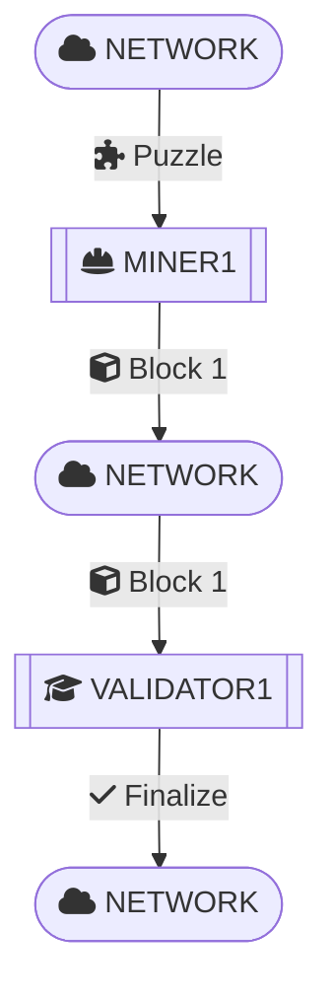
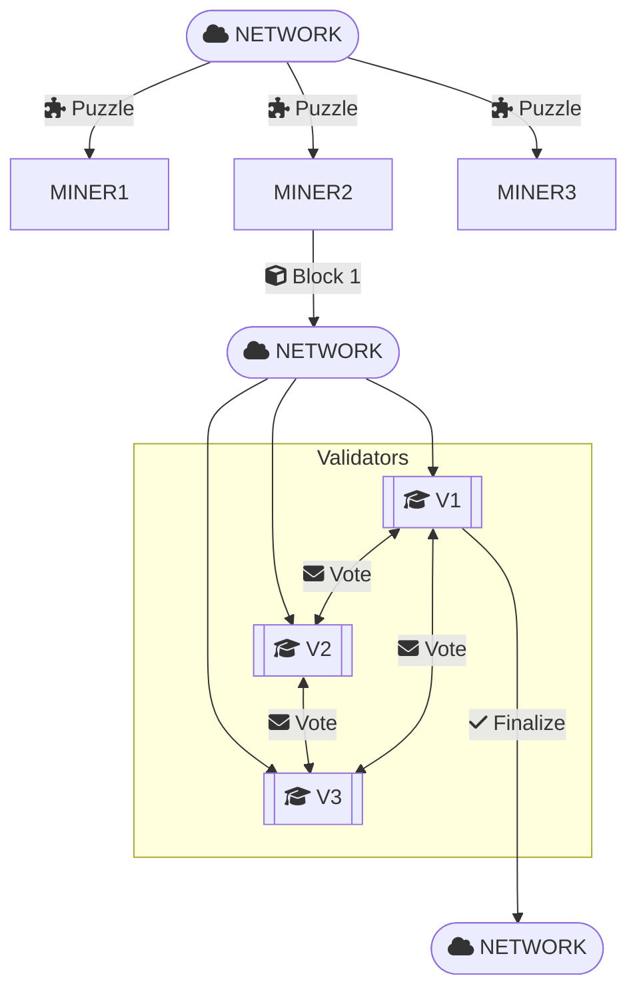

# Crosslink2 TLA⁺ Specification

A PlusCal ↔ TLA⁺ model of the Crosslink2 “trailing finality layer” for Zcash, as described in **A Trailing Finality Layer for Zcash** by Electric Coin Company.

📖 [Read the full TFL book](https://electric-coin-company.github.io/tfl-book/)

## Disclamer

This specification is my **personal interpretation** of Crosslink2. It is intended as **experimental**, **highly theoretical** work—primarily a vehicle for exploring, understanding, and validating the protocol in TLA⁺.  

Feedback and improvements are very welcome!

## Motivation

While the TFL book is the definitive guide, its formal presentation can be challenging to digest. By encoding Crosslink2 in PlusCal/TLA⁺ we aim to:

- **Demystify the protocol**: Present a step-by-step, executable description of Crosslink2’s hybrid PoW + PoS consensus.  
- **Bridge theory and practice**: Surface the key state machines, messages, and invariants in a way that is easier for engineers and cryptographers to follow.
- **Mechanize theorems**: Encode and automatically check the book’s safety and liveness theorems (e.g., σ-finality, assured finality, bounded availability) using TLC.  
- **Aid implementation & review**: Serve as a reference model for anyone building or auditing a Crosslink2 implementation in Zcash or other systems.

This is **one more tool** in the ecosystem, another way to explore, visualize, and ultimately strengthen confidence in Crosslink2’s design.  

## The protocol

This section walks through our abstract PlusCal → TLA⁺ model of Crosslink2. Rather than capturing every low-level detail of a real blockchain, we focus on the core roles, their interactions, and the agreement (voting) mechanism.

### Overview

We model a shared "network" state that all participants read from and write to. In reality each node has its own copy of the chain and metadata, but here we collapse it into one global state for simplicity.

The shared state includes:

- **blocks** - a sequence of block header records (both finalized and pending).
- **currentHeight** – the height of the latest (non-finalized) block.
- **finalizedHeight** – the height of the latest block that validators have agreed to finalize.

Participants are modeled as processes:

- **Miners** generate new blocks (incrementing `currentHeight`)
- **Validators** exchange votes and, once they reach a quorum, increment `finalizedHeight`.

All of the PlusCal code lives in [protocol.tla](protocol.tla); what follows is a high-level description of how it behaves.

### Shared-State Variables

```
  blocks          \* Sequence of block records: { height, context_bft, finalized }
  currentHeight   \* Latest block height (pending tip)
  finalizedHeight \* Latest block height that’s been finalized
  stalled         \* TRUE when (currentHeight – finalizedHeight) > L
  votingHeight    \* Height of the block currently under vote (0 = no round)
  votes           \* [v ∈ Validators ↦ BOOLEAN] map of who has voted this round
```

### Participants

#### Miners

Compete to solve the PoW puzzle.

When any miner "finds" a solution, it appends a new header to blocks and:

```
currentHeight := currentHeight + 1
```

The new block’s `context_bft` is set to the current `finalizedHeight`.

#### Validators

Watch for new blocks and, when one reaches ≥ Sigma confirmations, start a voting round:

```
votingHeight := finalizedHeight + 1;
votes        := [ v ∈ Validators ↦ (v = self) ]
```

Each validator then casts one vote per round.

When `Cardinality({v | votes[v] = TRUE}) ≥ VoteThreshold`, they finalize:

```
    blocks[votingHeight].finalized := TRUE;
    finalizedHeight                := votingHeight;
    votingHeight                   := 0;
    votes                          := [ v ∈ Validators ↦ FALSE ];
```

If the gap (`currentHeight – finalizedHeight`) ever exceeds `L`, both miners and validators stall (no new blocks or votes) until `finalizedHeight` catches up.

### Examples

**1 Miner, 1 Validator, 1 Block**



```
CONSTANTS
  MaxHeight     = 1
  Sigma         = 0
  Miners        = {"Miner1"}
  Validators    = {"FinalityValidator1"}
  L             = 2
  VoteThreshold = 1
```

**3 Miners, 3 Validators, Simple Majority**



```
CONSTANTS
  MaxHeight     = 1
  Sigma         = 0
  Miners        = {"Miner1","Miner2","Miner3"}
  Validators    = {"FinalityValidator1","FinalityValidator2","FinalityValidator3"}
  L             = 2
  VoteThreshold = 2
```

**2 Blocks, 3 Validators, 1-Depth Finality**

```
CONSTANTS
  MaxHeight     = 2
  Sigma         = 1
  Miners        = {"Miner1"}
  Validators    = {"FinalityValidator1","FinalityValidator2","FinalityValidator3"}
  L             = 2
  VoteThreshold = 2
```

Here, the first block is mined at height 1, then one confirmation (height 2) makes it finalizable (σ = 1), so validators will agree on it.

### Exploring the State Space

You can vary `MaxHeight`, `Sigma`, `Miners`, `Validators`, `L`, and `VoteThreshold` to see how quickly TLC’s state space grows. For example:

|      Sample      | MaxHeight | Sigma | Miners | Validators |  L  | VoteThreshold |   Result  | #States |
| :--------------: | :-------: | :---: | :----: | :--------: | :-: | :-----------: | :-------: | :-----: |
| [1](sample1.cfg) |     1     |   0   |    1   |      1     |  2  |       1       | Finalized |    6    |
| [2](sample2.cfg) |     1     |   0   |    3   |      3     |  2  |       2       | Finalized |   216   |
| [3](sample3.cfg) |     2     |   1   |    1   |      3     |  2  |       2       | Finalized |    55   |
| [4](sample4.cfg) |     10    |   3   |    1   |      2     |  10 |       2       | Finalized |  5 080  |

## The properties

We encode and check some Crosslink2 theorems and guarantees in [properties.tla](properties.tla). Here is a mapping of each property to its description and the corresponding section or theorem in the TFL book.

| Property                    | Description                                                                                      | Reference                                                                                                                                                                                     |
| --------------------------- | ------------------------------------------------------------------------------------------------ | --------------------------------------------------------------------------------------------------------------------------------------------------------------------------------------------- |
| `FinalizedHeightConsistent` | `finalizedHeight` always names a truly finalized block and never decreases.                     | [Security Analysis – Definition: Assured Finality](https://electric-coin-company.github.io/tfl-book/design/crosslink/security-analysis.html#definition-assured-finality) *(search for “Assured Finality”) *no direct ref.** |
| `ContiguousFinality`        | All blocks with height < `finalizedHeight` are also marked finalized (no gaps in the prefix).  | [Security Analysis – Concrete Analysis §5.2](https://electric-coin-company.github.io/tfl-book/design/crosslink/security-analysis.html#3.3.4-Security-Analysis-of-Crosslink-2) *(search for “Concrete Analysis”)* |
| `ContextMonotonic`          | Every block’s `context_bft` ≥ its parent’s (`Linearity` of snapshots).                         | [Construction – Linearity Rule](https://electric-coin-company.github.io/tfl-book/design/crosslink/construction.html#the-crosslink-2-construction) *(search for “Linearity rule”)*             |
| `StalledCorrect`            | `stalled = TRUE` exactly when `(currentHeight - finalizedHeight) > L`.                           | [Construction – Bounded Availability](https://electric-coin-company.github.io/tfl-book/design/crosslink/construction.html#the-arguments-for-bounded-availability-and-finality-overrides) *(search for “bounded availability”)* |
| `LNonDeadlock`              | `L ≥ Sigma`, so the system cannot permanently stall.                                            | [Questions – Stall-Depth Discussion](https://electric-coin-company.github.io/tfl-book/design/crosslink/questions.html#questions-about-crosslink) *(search for “stall”)*                      |
| `VoteThresholdBound`        | `VoteThreshold ≤ |Validators|` ensures a quorum is reachable.                                     | [Security Analysis – Subprotocol Compromise Analysis §5.1.2](https://electric-coin-company.github.io/tfl-book/design/crosslink/security-analysis.html#5.1.2-Subprotocol-Compromise-Analysis) *(search for “one-third bound”)* |
| `VoteMapReset`              | When `votingHeight = 0`, the per-round `votes` map is cleared to all `FALSE`.                   | [Construction – The Crosslink 2 Construction](https://electric-coin-company.github.io/tfl-book/design/crosslink/construction.html#13) *(search for “votes :=”)*                             |
| `VotesOnlyDuringVoting`     | No validator may set `votes[v] = TRUE` unless a round is active (`votingHeight ≠ 0`).           | [Construction – The Crosslink 2 Construction](https://electric-coin-company.github.io/tfl-book/design/crosslink/construction.html#13) *(search for “votes[self]”)*                          |
| `SigmaFinality`             | A block is only finalized if it had at least `Sigma` confirmations on the PoW chain.            | [Construction – Tail Confirmation Rule](https://electric-coin-company.github.io/tfl-book/design/crosslink/construction.html#12) *(search for “σ”)*                                          |
| `NoRollbackPastFinal`       | Finalized blocks may never be removed or rolled back.                                            | [Security Analysis – LOG_fin Safety](https://electric-coin-company.github.io/tfl-book/design/crosslink/security-analysis.html#definition-assured-finality) *(search for “never be rolled back”)* |
| `AssuredFinality`           | Honest validators never finalize conflicting chains (finalized prefixes always agree).          | [Security Analysis – Definition: Assured Finality](https://electric-coin-company.github.io/tfl-book/design/crosslink/security-analysis.html#definition-assured-finality) *(search for “Assured Finality”)* |
| `EventualFinality`          | Every finalizable block (`h + Sigma ≤ MaxHeight`) will eventually be marked `finalized`.         | [Questions – BFT Liveness](https://electric-coin-company.github.io/tfl-book/design/crosslink/questions.html#3.3.5-Questions-About-Crosslink) *(search for “liveness”) *no direct ref.**      |
| `NoPermanentStall`          | Any stall (`gap > L`) will eventually shrink back to ≤ `L` (recovery from stall).               | [Construction – Bounded Availability](https://electric-coin-company.github.io/tfl-book/design/crosslink/construction.html#the-arguments-for-bounded-availability-and-finality-overrides) *(search for “stalled”)* |

> [!CAUTION]
> Above table is incorrect, fix.

## Model checking

We validate our Crosslink2 model by running the TLC model checker against all of our invariants and temporal properties. We recommend using the **VS Code TLA⁺ extension**:

> 🔗 [Visual Studio Code – TLA+ Extension](https://marketplace.visualstudio.com/items?itemName=alygin.vscode-tlaplus)

### Getting Started in VS Code

1. **Install** the TLA⁺ extension.  
2. **Open** `properties.tla` (this is the module that `EXTENDS protocol` and contains *all* your `INVARIANT` and `PROPERTY` definitions). 
3. Press <kbd>⇧⌘P</kbd> (macOS) or <kbd>Ctrl+Shift+P</kbd> (Windows/Linux) and choose:  
   - **TLA+: Model check with TLC**  
     Runs TLC with the **default** configuration (`properties.cfg`) file.  
   - **TLA+: Model check with TLC using non-default config**  
     Prompts you to select one of the sample `.cfg` files in the repo.

### The configuration file

#### CONSTANTS

These parameters configure your model. We type-check them with the `ConstantsTC` invariant.

| Constant | Description | Type |
| -------- | ----------- | ---- |
| `MaxHeight` | The maximum height of the blockchain. | Nat |
| `Sigma` | The confirmation depth required for finality. | Nat |
| `Miners` | The set of miners in the network. | Set of Strings |
| `Validators` | The set of validators in the network. | Set of Strings |
| `L` | The maximum gap between finalized and proposed blocks before entering stalled mode. | Nat |
| `VoteThreshold` | The number of votes required to finalize a block. | Nat |

#### VARIABLE INVARIANTS

We enforce the type of the network state (variables like `blocks`, `currentHeight`, `finalizedHeight`, etc.) using the `VariableTC` invariant.

#### INVARIANTS

The following invariants must hold in every reachable state:

- `FinalizedHeightConsistent`
- `ContiguousFinality`
- `ContextMonotonic`
- `StalledCorrect`
- `LNonDeadlock`
- `VoteThresholdBound`
- `VoteMapReset`
- `VotesOnlyDuringVoting`
- `SigmaFinality`
- `NoRollbackPastFinal`
- `AssuredFinality`

#### PROPERTIES

These temporal properties express liveness and recovery guarantees:

- `NoPermanentStall`
- `EventualFinality`

### Running TLC from the Command Line

If you prefer CLI, you can also invoke TLC directly:

```bash
# Download the TLA⁺ tools:
wget https://github.com/tlaplus/tlaplus/releases/latest/download/tla2tools.jar

# Using the default .cfg:
java -cp tla2tools.jar tlc2.TLC -config properties.cfg properties.tla

# Or specify the .cfg inline:
java -cp tla2tools.jar tlc2.TLC -config sample1.cfg properties.tla
```

> [!CAUTION]
> Above not working because code has unicode.

> [!TIP]
> Keep `MaxHeight` small for faster checks. Each additional block height or validator multiplies the state space exponentially.

Once TLC completes without errors or counterexamples, you’ll have confidence that your TLA⁺ model satisfies all of the modelled Crosslink2 safety and liveness theorems under honest assumptions.

## Conclusion & Next Steps

This TLA⁺/PlusCal model gives a concise, executable view of the Crosslink2 trailing‐finality layer, including:

- A parameterized PoW chain with miners proposing new blocks.  
- A BFT‐style voting layer where validators finalize blocks once they reach ≥ σ confirmations.  
- Safety and liveness theorems from the TFL book mechanized as invariants and temporal properties.  
- A simple "network" abstraction, stall‐mode, and majority‐voting mechanism.

By model‐checking with TLC, we’ve gained confidence that under **honest‐node assumptions** the core guarantees hold.  

## Future Work

- **Byzantine Behavior:** Add malicious validator processes to test the ⅓‐fault‐tolerance bound and equivocation handling.
- **Local States and forks:** Instead of one global chain, give each miner and validator its own local copy of `blocks`, `currentHeight`, `finalizedHeight`, etc., and model block-and-vote messages between them. This lets you simulate network latency and partitions—so different nodes can see different tips, produce conflicting forks, and then reconcile once messages arrive.
- **Performance Tuning:** Experiment with larger configurations.

## Contributing

Feedback, bug reports, and pull requests are welcome!  

## License

This project is released under the **MIT License**. See [LICENSE](LICENSE) for details.
